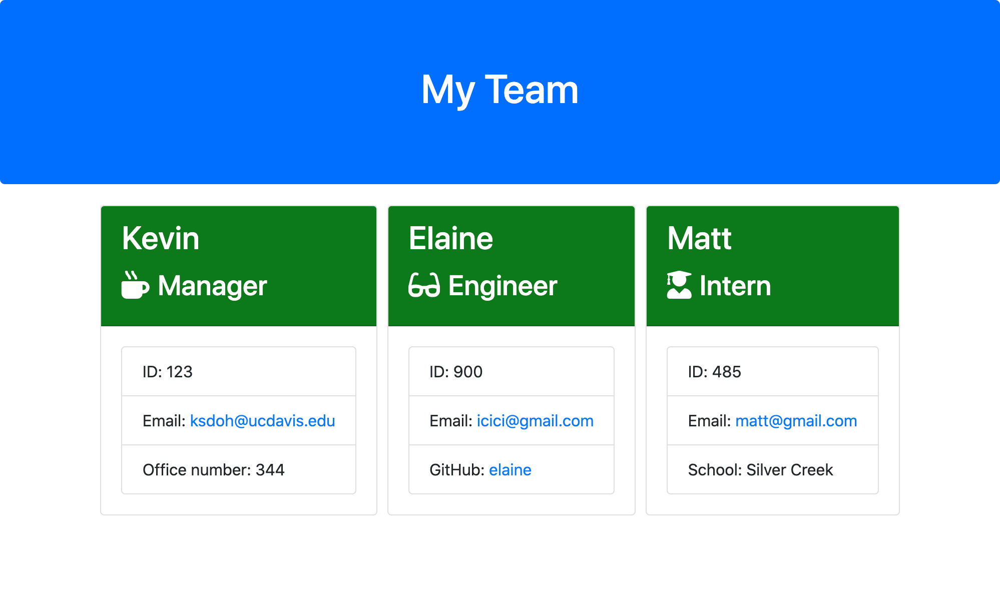

# Homework 10: Template Engine - Employee Summary

## Description
This application is a command line interface that prompts the user to input information about their team and then creates a new, styled HTML file based on this information.

## Demo
<a href="https://youtu.be/sqE-VtEFJYw">YouTube video</a>

## Credits
* HTML
* CSS
* Javascript
* Bootstrap
* Node.js
* inquirer
* jest

## Contact
* kdoh52@gmail.com
